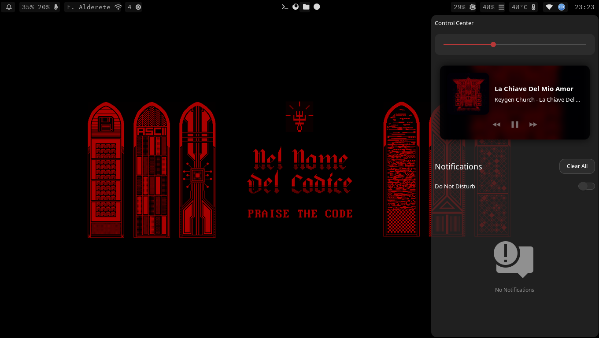

# My hyprland dots

# Moved to [dots](https://github.com/Tom5521/dots)

## Installing

You can install it running the following commands:

```bash
cd /tmp
git clone https://github.com/Tom5521/HyprlandDots.git --recursive
cd HyprlandDots
just install
```

## Screenshots

<!--  -->
<!--  -->





https://github.com/user-attachments/assets/e81512cf-3eaa-4534-85f7-dd55534dd79e


Current theme: Material Black Cherry

Icon theme: Papirus Dark

Mouse: Empty Butterfly White vr6

## Keybinds

| **Keybind**                           | **Action**                                            |
| ------------------------------------- | ----------------------------------------------------- |
| `$mainMod + Q`                        | Kill the active window                                |
| `$mainMod + SHIFT + Q`                | Exit the window manager                               |
| `$mainMod + SHIFT + Space`            | Toggle floating mode for the active window            |
| `$mainMod + I`                        | Pseudo mode for window tiling (dwindle layout)        |
| `$mainMod + SHIFT + J`                | Toggle split layout (dwindle layout)                  |
| `$mainMod + _ (code:95)`              | Toggle fullscreen mode                                |
| `$mainMod + S`                        | Toggle window grouping                                |
| `$mainMod + P`                        | Pin the active window                                 |
| `$mainMod + SHIFT + Left`             | Move window left                                      |
| `$mainMod + SHIFT + Right`            | Move window right                                     |
| `$mainMod + SHIFT + Up`               | Move window up                                        |
| `$mainMod + SHIFT + Down`             | Move window down                                      |
| `$mainMod + L`                        | Resize window (increase width by 10)                  |
| `$mainMod + J`                        | Resize window (decrease width by 10)                  |
| `$mainMod + I`                        | Resize window (decrease height by 10)                 |
| `$mainMod + K`                        | Resize window (increase height by 10)                 |
| `$mainMod + mouse_down`               | Switch to next workspace                              |
| `$mainMod + mouse_up`                 | Switch to previous workspace                          |
| `$mainMod + Left Mouse Button (LMB)`  | Move window by dragging                               |
| `$mainMod + Right Mouse Button (RMB)` | Resize window by dragging                             |
| `$mainMod + Left Arrow`               | Move focus to the window on the left                  |
| `$mainMod + Right Arrow`              | Move focus to the window on the right                 |
| `$mainMod + Up Arrow`                 | Move focus to the window above                        |
| `$mainMod + Down Arrow`               | Move focus to the window below                        |
| `$mainMod + W`                        | Launch Firefox browser                                |
| `$mainMod + D`                        | Launch `walker` program                               |
| `$mainMod + Enter`                    | Launch `kitty` terminal                               |
| `$mainMod + O`                        | Launch `nwg-look` to change GTK themes                |
| `$mainMod + F`                        | Launch `thunar` file manager                          |
| `$mainMod + C`                        | Launch Neovim                                         |
| `$mainMod + SHIFT + C`                | Launch VSCode                                         |
| `Print`                               | Capture screenshot using `grim`                       |
| `$mainMod + SHIFT + R`                | Reboot the system                                     |
| `$mainMod + SHIFT + P`                | Power off the system                                  |
| `$mainMod + H`                        | Launch `btop` system monitor                          |
| `$mainMod + M`                        | Launch music player                                   |
| `$mainMod + SHIFT + U`                | Launch `topgrade` update manager                      |
| `$mainMod + SHIFT + B`                | Toggle Bluetooth                                      |
| `$mainMod + V`                        | Show clipboard using `cliphist`                       |
| `$mainMod + SHIFT + W`                | Set a random wallpaper using `waypaper`               |
| `$mainMod + SHIFT + M`                | Launch `cava` audio visualizer                        |
| `$mainMod + N`                        | Show notifications using `swaync-client`              |
| `$mainMod + SHIFT + Enter`            | Launch `kitty` terminal in a special workspace        |
| `$mainMod + T`                        | Launch `kitty` terminal in a specific directory       |
| `$mainMod + SHIFT + H`                | Launch `btop` in a special workspace                  |
| `$mainMod + E`                        | Toggle `waybar`                                       |
| `$mainMod + L`                        | Lock screen using `gtklock`                           |
| `$mainMod + SHIFT + N`                | Toggle blue light filter                              |
| `$mainMod + SHIFT + A`                | Toggle audio source to use phone as a microphone      |
| `$mainMod + SHIFT + S`                | Toggle `scrcpy` audio                                 |
| `$mainMod + CTRL + S`                 | Launch `tcpip-scrcpy`                                 |
| `$mainMod + SHIFT + V`                | Launch `nwg-clipman` clipboard manager                |
| `XF86AudioRaiseVolume`                | Increase system volume by 5%                          |
| `XF86AudioLowerVolume`                | Decrease system volume by 5%                          |
| `XF86AudioMute`                       | Toggle system audio mute                              |
| `XF86MonBrightnessUp`                 | Increase screen brightness by 10%                     |
| `XF86MonBrightnessDown`               | Decrease screen brightness by 10%                     |
| `XF86AudioPlay`                       | Play/pause media                                      |
| `XF86AudioNext`                       | Skip to next media track                              |
| `XF86AudioPrev`                       | Go to previous media track                            |
| `$mainMod + Tab`                      | Switch to next workspace                              |
| `$mainMod + SHIFT + Tab`              | Switch to previous workspace                          |
| `$mainMod + [0-9]`                    | Switch to a specific workspace (1-10)                 |
| `$mainMod + K`                        | Switch to workspace 11 (Virtual Machines)             |
| `$mainMod + SHIFT + [0-9]`            | Move active window to a specific workspace (1-10)     |
| `$mainMod + SHIFT + K`                | Move active window to workspace 11 (Virtual Machines) |

## License

[MIT](https://choosealicense.com/licenses/mit/)
