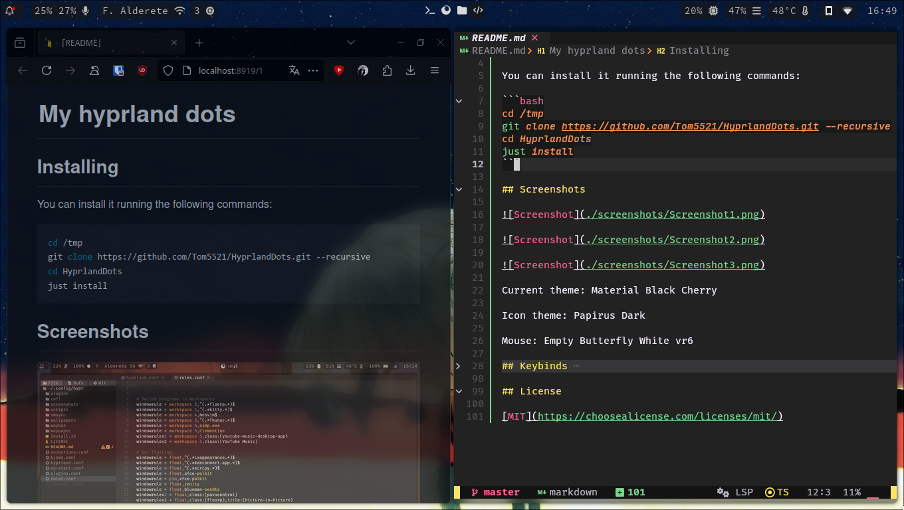

# My hyprland dots

## Screenshots

Current theme: Material Black Blueberry LA

Icon theme: Papirus

Mouse: Empty Butterfly White vr6

## Programs

- Browser: Thorium
- Terminal: Kitty
- Music Player: YT music :v
- Editor: Neovim
- Bar: Waybar
- Wallpaper: Waypaper

## Requirements

### O = Optional

### N = Obligatory

- Hyprland (N)
- waybar (N)
- waypaper (N)
- C++ compiler (for the plugins) (N)
- rofi (N)
- cliphist (N)
- wl-clipboard (N)
- nm-applet (N)
- xfce4-polkit (N)
- hy3 (O) (git or not,depending on your hyprland version)
- swaync (O)
- blueman (O)
- btop (O)
- cava (O)
- kdeconnect (O)
- grim (O)

## Key Binds

### MainMod Binding

#### **ModKey is SUPER**

- **Toggle Waybar:** Press `ModKey` + `E` to execute the Python script for toggling Waybar visibility.
- **Open Notification Center:** `ModKey` + `N`

### Window Control

- **Close Active Window:** `ModKey` + `Q`
- **Exit Hyprland:** `ModKey` + `Shift` + `Q`
- **Toggle Floating Mode:** `ModKey` + `Shift` + `Space`
- **Pseudo dwindle:** `ModKey` + `P`
- **Toggle Split in dwindle:** `ModKey` + `Shift` + `J`
- **Fullscreen:** `ModKey` + `Code:95`
- **Toggle Window Group:** `ModKey` + `S`
- **Pin Window:** `ModKey` + `Shift` + `P`
- **Move Window:** `ModKey` + `Shift` + Arrow keys (`Left`, `Right`, `Up`, `Down`)
- **Resize Active Window:** `ModKey` + `L`, `J`, `I`, `K`

### Workspace Management

- **Scroll Workspaces:** `ModKey` + Scroll (`Mouse Down` for next, `Mouse Up` for previous)

### Move/Resize Windows (Mouse Interaction)

- **Move Window:** `ModKey` + `LMB` (Left Mouse Button)
- **Resize Window:** `ModKey` + `RMB` (Right Mouse Button)

### Move Focus

- **Move Focus:** `ModKey` + Arrow keys (`Left`, `Right`, `Up`, `Down`)

### Program Execution

- **Launch Browser:** `ModKey` + `W`
- **Launch Rofi:** `ModKey` + `D`
- **Launch Kitty Terminal:** `ModKey` + `Return`
- **Launch lxappearance:** `ModKey` + `O`
- **Open File explorer:** `ModKey` + `F`
- **Open neovim in the selected folder:** `ModKey` + `C`
- **Take Screenshot:** `Print` key
- **Reboot System:** `ModKey` + `Shift` + `R`
- **Launch btop:** `ModKey` + `H`
- **Launch Music Player:** `ModKey` + `M`
- **Run Topgrade:** `ModKey` + `Shift` + `U`
- **Toggle Bluetooth with bluezToggle script:** `ModKey` + `Shift` + `B`
- **List and Copy Clipboard History with wofi:** `ModKey` + `V`
- **Restore Waypaper with random image:** `ModKey` + `Shift` + `W`
- **Run Cava visualizer script:** `ModKey` + `Shift` + `M`
- **Run christmas visualizer script:** `ModKey` + `T`

### Control

#### Volume Keybinds

- **Increase Volume:** `XF86AudioRaiseVolume`
- **Decrease Volume:** `XF86AudioLowerVolume`
- **Mute/Unmute:** `XF86AudioMute`

#### Brightness Keybinds

- **Increase Brightness:** `XF86MonBrightnessUp`
- **Decrease Brightness:** `XF86MonBrightnessDown`

#### Multimedia Player Keys

- **Play/Pause:** `XF86AudioPlay`
- **Next Track:** `XF86AudioNext`
- **Previous Track:** `XF86AudioPrev`

## License

[MIT](https://choosealicense.com/licenses/mit/)
